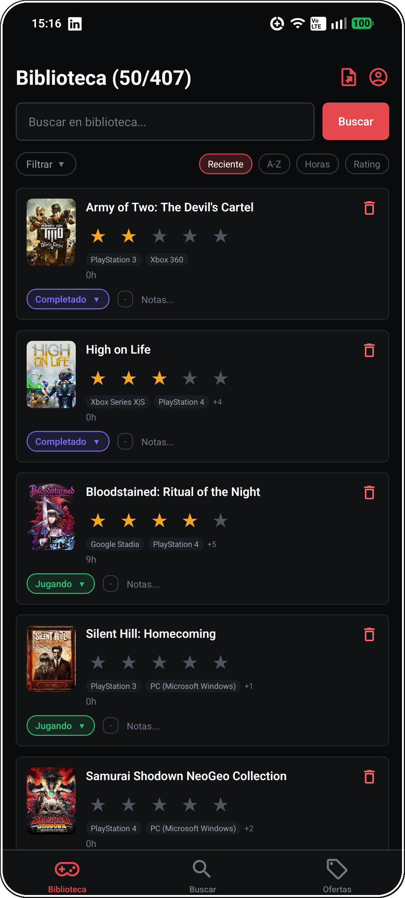
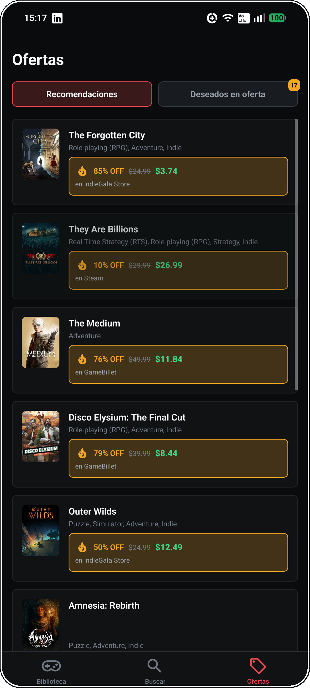
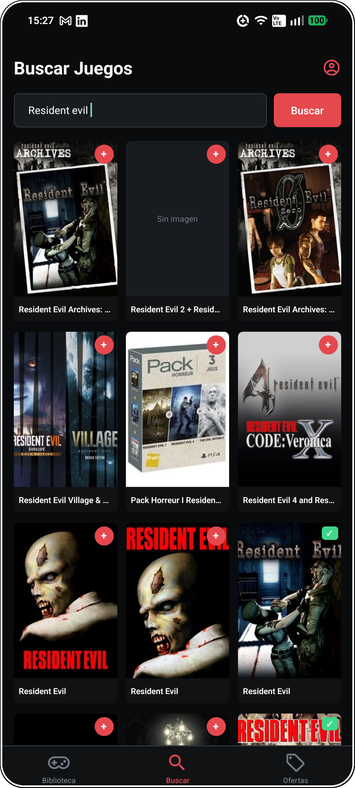

# GameVault

App de backlog de videojuegos para Android: qué tienes, qué quieres, y cuándo comprarlo más barato.

<table align="center">
  <tr>
    <td align="center">
       
      <b>Biblioteca</b>
    </td>
    <td align="center">
       
      <b>Ofertas</b>
    </td>
    <td align="center">
       
      <b>Buscar</b>
    </td>
  </tr>
</table>

## Por qué existe

Entre wishlists de Steam, notas sueltas y "algún día lo juego", la mayoría de la gente pierde de vista qué tiene pendiente y cuándo vale la pena comprarlo. GameVault junta las tres cosas: **biblioteca con estados reales** (wishlist, jugando, completado, abandonado), **precios de varias tiendas** para saber cuándo hay oferta, y **recomendaciones con IA** basadas en lo que ya jugaste y te gustó — no un top genérico.

## Features

- 🎮 Biblioteca con estado (wishlist/comprado/jugando/completado/abandonado) y prioridad de backlog
- 🔍 Búsqueda con metadata real (portada, tiempo estimado para completarlo, géneros) vía IGDB
- 💰 Comparación de precios entre tiendas, con detección de duplicados entre ediciones
- 🤖 Recomendaciones con IA a partir de tus juegos completados, mezclando conocidos y "hidden gems"
- 📊 Dashboard con estadísticas de tu biblioteca
- 📥 Exportar tu biblioteca a Excel

## Stack

React Native · TypeScript · React Navigation · MMKV

> API en Node.js + PostgreSQL: **[gamevault_server](https://github.com/Hector0122/gamevault_server)**

## Licencia

MIT — ver [LICENSE](LICENSE)
